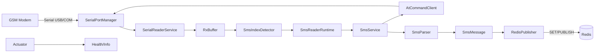
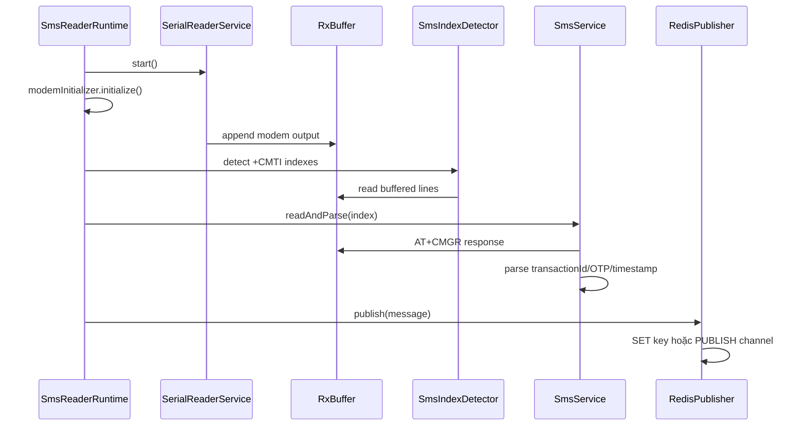
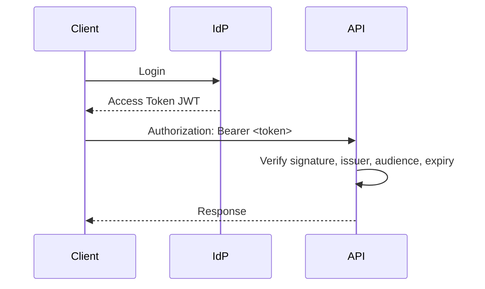

# Operations Documentation / SOP - SMS Serial Reader

Phiên bản: 1.0  
Ngày cập nhật: 2026-05-07  
Phạm vi: vận hành backend Java Spring Boot đọc SMS từ GSM modem qua serial port và publish dữ liệu đã parse sang Redis.  
Đối tượng sử dụng: developer, DevOps/SRE, QA, đội vận hành production, đội nhận bàn giao.

## Mục lục

1. [Tổng quan hệ thống](#1-tổng-quan-hệ-thống)
2. [Cấu trúc source code](#2-cấu-trúc-source-code)
3. [Quy trình setup môi trường](#3-quy-trình-setup-môi-trường)
4. [Quy trình build và deploy](#4-quy-trình-build-và-deploy)
5. [Quy trình vận hành hệ thống](#5-quy-trình-vận-hành-hệ-thống)
6. [Quy trình xử lý sự cố](#6-quy-trình-xử-lý-sự-cố)
7. [API Operations](#7-api-operations)
8. [Database Operations](#8-database-operations)
9. [Security Operations](#9-security-operations)
10. [Monitoring và Logging](#10-monitoring-và-logging)
11. [Checklist vận hành production](#11-checklist-vận-hành-production)
12. [Onboarding developer mới](#12-onboarding-developer-mới)
13. [Tài liệu bàn giao](#13-tài-liệu-bàn-giao)
14. [FAQ và Troubleshooting](#14-faq-và-troubleshooting)

## Thông tin dự án

| Hạng mục | Giá trị |
|---|---|
| Tên dự án | SMS Serial Reader |
| Artifact | `com.example:sms-serial-reader:1.0.0` |
| Mô tả | Service đọc SMS từ GSM modem qua serial port, parse transaction ID/OTP/timestamp và publish JSON sang Redis |
| Domain nghiệp vụ | Integration/Notification/OTP processing |
| Kiến trúc | Monolith nhỏ, single Spring Boot service |
| Java | 21 theo `pom.xml`; README ghi Java 17+. Chuẩn vận hành khuyến nghị: Java 21 LTS |
| Spring Boot | 3.3.7 |
| Build tool | Maven |
| Database | Chưa sử dụng database quan hệ |
| Cache/Message backend | Redis qua Lettuce |
| Queue | Redis key/channel. Chưa sử dụng Kafka/RabbitMQ |
| Deployment | Hiện chưa có Dockerfile/CI trong repo; tài liệu có phần khuyến nghị Docker/systemd/Kubernetes |
| Health check | Spring Boot Actuator: `/actuator/health`, `/actuator/info` |
| Log | Console + rolling file `logs/sms-reader.log` |

## Giả định và ghi chú

- Tài liệu này ưu tiên đúng với source code hiện tại của `sms-serial-reader`.
- Các phần database, Kafka/RabbitMQ, CI/CD, Kubernetes được viết theo hướng chuẩn hóa production cho trường hợp dự án mở rộng sau này.
- Hệ thống có phụ thuộc phần cứng GSM modem. Production nên chạy trên Linux host hoặc VM có quyền truy cập trực tiếp USB serial device.
- Docker Desktop trên Windows thường không expose trực tiếp COM port cho Linux container. Khi chạy container nên dùng Linux host hoặc WSL2 đã map USB.

## 1. Tổng quan hệ thống

### 1.1 Mục tiêu hệ thống

Hệ thống có nhiệm vụ:

- Kết nối GSM modem qua serial port.
- Khởi tạo modem bằng AT command.
- Lắng nghe thông báo SMS mới `+CMTI`.
- Đọc SMS bằng `AT+CMGR`.
- Parse nội dung SMS để lấy `transactionId`, `otp`, `timestamp`.
- Publish dữ liệu chuẩn hóa sang Redis.
- Cung cấp health endpoint để giám sát trạng thái service.

### 1.2 Kiến trúc tổng thể



### 1.3 Các service/module chính

| Module/package | Vai trò |
|---|---|
| `com.example.sms` | Entry point Spring Boot |
| `app` | Runtime lifecycle, poll loop, schedule unread SMS |
| `config` | Configuration properties và scheduler |
| `serial` | Quản lý serial port, reader thread, AT command client, receive buffer |
| `modem` | Khởi tạo modem, detect SMS index từ `+CMTI` |
| `smsreader` | Đọc SMS, parse SMS, domain model `SmsMessage` |
| `redis` | Serialize JSON và publish/set vào Redis |
| `exception` | Exception nghiệp vụ/kỹ thuật riêng |

### 1.4 Luồng xử lý chính



### 1.5 Luồng scheduled unread scan

Service có cơ chế quét SMS chưa đọc định kỳ theo `UNREAD_POLL_INTERVAL_MS`. Mục tiêu là giảm rủi ro mất event `+CMTI` do modem/restart. Khi Redis ở mode LIST hiện tại trong code thực tế đang dùng `SET` để lưu payload mới nhất, scheduled scan dùng compare timestamp/index để tránh ghi đè bằng SMS cũ.

## 2. Cấu trúc source code

### 2.1 Package structure hiện tại

```text
src/main/java/com/example/sms
├── SmsReaderApplication.java
├── app/
│   └── SmsReaderRuntime.java
├── config/
│   ├── AppConfig.java
│   └── SchedulerConfig.java
├── exception/
├── modem/
├── redis/
├── serial/
└── smsreader/
```

### 2.2 Mapping với cấu trúc backend Spring Boot chuẩn

| Layer chuẩn | Tình trạng hiện tại | Quy ước khi mở rộng |
|---|---|---|
| `controller` | Chưa có business API, chỉ Actuator | Thêm REST API vào `controller`, không chứa business logic |
| `service` | `SmsService`, runtime service | Chứa orchestration, transaction boundary, business rule |
| `repository` | Chưa có database | Chỉ truy cập database, không chứa rule nghiệp vụ |
| `entity` | Chưa có JPA entity | Đại diện table, không expose trực tiếp ra API |
| `dto` | Chưa có API DTO | Request/response model riêng, validate bằng Jakarta Validation |
| `mapper` | Chưa có | Map entity/domain/DTO, ưu tiên MapStruct nếu mapping phức tạp |
| `config` | Có `AppConfig`, `SchedulerConfig` | Chỉ chứa bean/configuration/properties |
| `exception` | Có custom exception | Chuẩn hóa error handling khi có API |

### 2.3 Convention đặt tên

| Loại | Convention | Ví dụ |
|---|---|---|
| Class service | `XxxService` | `SmsService` |
| Runtime/orchestrator | `XxxRuntime`, `XxxProcessor` | `SmsReaderRuntime` |
| Config properties | `XxxConfig`, `XxxProperties` | `AppConfig` |
| Exception | `XxxException` | `RedisPublishException` |
| DTO request | `XxxRequest` | `CreateWebhookRequest` |
| DTO response | `XxxResponse` | `SmsMessageResponse` |
| Repository | `XxxRepository` | `SmsMessageRepository` |
| Test | `XxxTest` | `SmsParserTest` |

### 2.4 Quy tắc phân tầng

- Controller chỉ nhận request, validate, gọi service, trả response.
- Service chứa business logic và orchestration.
- Repository chỉ thao tác persistence.
- Entity không được expose trực tiếp ra API response.
- DTO không chứa logic nghiệp vụ phức tạp.
- Mapper chịu trách nhiệm chuyển đổi object.
- Config không thực hiện I/O runtime nặng nếu không cần thiết.
- Exception dùng loại cụ thể để dễ xử lý và alert.
- Không truy cập Redis/serial port trực tiếp từ controller.

### 2.5 Coding convention

- Java 21, Spring Boot 3.x, Jakarta namespace.
- Dùng constructor injection, ưu tiên `final` dependency.
- Không swallow exception nếu lỗi ảnh hưởng dữ liệu/vận hành; log kèm context.
- Log không chứa OTP đầy đủ ở production nếu yêu cầu bảo mật cao.
- Config phải đọc qua environment variable hoặc secret manager, không hard-code secret.
- Unit test bắt buộc cho parser, buffer, detector, config binding.
- Integration test bắt buộc cho Redis publishing nếu thay đổi contract message.

## 3. Quy trình setup môi trường

### 3.1 Dependencies

| Thành phần | Version khuyến nghị |
|---|---|
| JDK | 21 LTS |
| Maven | 3.9+ |
| Redis | 6+ hoặc 7+ |
| GSM modem | Hỗ trợ AT command SMS text mode |
| OS production | Linux |

Kiểm tra version:

```bash
java -version
mvn -version
redis-cli --version
```

### 3.2 Setup local environment

1. Clone source:

```bash
git clone <repository-url>
cd sms-serial-reader
```

2. Tạo file `.env`:

```bash
cp .env.example .env
```

3. Cập nhật serial port:

```env
SERVER_PORT=8080
SERIAL_PORT=COM9
BAUD_RATE=115200
REDIS_HOST=127.0.0.1
REDIS_PORT=6379
REDIS_PASSWORD=
REDIS_DATABASE=0
REDIS_QUEUE_NAME=sms:incoming
REDIS_MODE=LIST
REDIS_PUBLISH_RETRIES=3
DELETE_SMS_AFTER_READ=false
UNREAD_POLL_INTERVAL_MS=60000
```

Trên Linux:

```bash
ls -l /dev/ttyUSB* /dev/ttyACM*
sudo usermod -aG dialout $USER
```

Sau khi thêm user vào group `dialout`, logout/login lại.

### 3.3 File cấu hình Spring Boot

`src/main/resources/application.yml` đang hỗ trợ override qua environment variable:

```yaml
server:
  port: ${SERVER_PORT:8080}

sms:
  serial:
    port: ${SERIAL_PORT:COM9}
    baud-rate: ${BAUD_RATE:115200}
  redis:
    host: ${REDIS_HOST:127.0.0.1}
    port: ${REDIS_PORT:6379}
    password: ${REDIS_PASSWORD:}
    database: ${REDIS_DATABASE:0}
    queue-name: ${REDIS_QUEUE_NAME:sms:incoming}
    mode: ${REDIS_MODE:LIST}
    publish-retries: ${REDIS_PUBLISH_RETRIES:3}
  behavior:
    delete-sms-after-read: ${DELETE_SMS_AFTER_READ:false}
    unread-poll-interval-ms: ${UNREAD_POLL_INTERVAL_MS:60000}
```

### 3.4 Docker setup

Repo hiện tại chưa có `Dockerfile`/`docker-compose.yml`. Nếu triển khai Docker, khuyến nghị thêm:

```dockerfile
FROM eclipse-temurin:21-jre
WORKDIR /app
COPY target/sms-serial-reader-1.0.0.jar app.jar
EXPOSE 8080
ENTRYPOINT ["java", "-jar", "/app/app.jar"]
```

Ví dụ `docker-compose.yml`:

```yaml
services:
  redis:
    image: redis:7-alpine
    ports:
      - "6379:6379"

  sms-reader:
    build: .
    depends_on:
      - redis
    environment:
      SERVER_PORT: 8080
      SERIAL_PORT: /dev/ttyUSB0
      BAUD_RATE: 115200
      REDIS_HOST: redis
      REDIS_PORT: 6379
      REDIS_QUEUE_NAME: sms:incoming
      REDIS_MODE: LIST
    devices:
      - "/dev/ttyUSB0:/dev/ttyUSB0"
    volumes:
      - ./logs:/app/logs
    ports:
      - "8080:8080"
```

### 3.5 Run project local

Build và chạy bằng jar:

```bash
mvn clean package
java -jar target/sms-serial-reader-1.0.0.jar
```

Chạy trực tiếp bằng Maven:

```bash
mvn spring-boot:run
```

Kiểm tra health:

```bash
curl http://localhost:8080/actuator/health
curl http://localhost:8080/actuator/info
```

Kiểm tra Redis output:

```bash
redis-cli GET sms:incoming
redis-cli SUBSCRIBE sms:incoming
```

### 3.6 Run bằng IntelliJ

1. Import project dạng Maven.
2. Chọn JDK 21.
3. Enable annotation processing cho Lombok.
4. Tạo Run Configuration:
   - Main class: `com.example.sms.SmsReaderApplication`
   - Working directory: repo root
   - Environment variables: copy từ `.env`
5. Start Redis local trước khi chạy app.
6. Chạy app và kiểm tra `/actuator/health`.

### 3.7 Database migration

Hiện tại project không dùng database quan hệ nên chưa có Flyway/Liquibase.

Khi bổ sung database:

- Chọn Flyway cho migration tuyến tính, dễ vận hành.
- Mỗi thay đổi schema phải có file migration versioned.
- Không sửa file migration đã chạy ở môi trường shared.
- Tách migration destructive thành nhiều bước: add nullable column, backfill, switch code, drop old column.

Ví dụ cấu trúc:

```text
src/main/resources/db/migration
├── V1__init_schema.sql
├── V2__add_sms_message_table.sql
└── V3__add_index_sms_message_timestamp.sql
```

## 4. Quy trình build và deploy

### 4.1 Build project

```bash
mvn clean verify
mvn clean package -DskipTests
```

Artifact:

```text
target/sms-serial-reader-1.0.0.jar
```

### 4.2 Maven command chuẩn

| Mục đích | Command |
|---|---|
| Chạy test | `mvn test` |
| Verify đầy đủ | `mvn clean verify` |
| Build jar | `mvn clean package` |
| Chạy local | `mvn spring-boot:run` |
| Bỏ test khi emergency build | `mvn clean package -DskipTests` |

### 4.3 Docker build

Khi đã có Dockerfile:

```bash
docker build -t sms-serial-reader:1.0.0 .
docker run --rm --device=/dev/ttyUSB0:/dev/ttyUSB0 --env-file .env -p 8080:8080 sms-serial-reader:1.0.0
```

### 4.4 CI/CD pipeline khuyến nghị


Ví dụ GitHub Actions:

```yaml
name: ci

on:
  pull_request:
  push:
    branches: [main]

jobs:
  build:
    runs-on: ubuntu-latest
    steps:
      - uses: actions/checkout@v4
      - uses: actions/setup-java@v4
        with:
          distribution: temurin
          java-version: "21"
          cache: maven
      - run: mvn clean verify
      - run: mvn clean package -DskipTests
```

### 4.5 Deploy staging

Quy trình khuyến nghị:

1. Build artifact từ commit đã merge vào `main` hoặc release branch.
2. Deploy lên staging host có Redis staging và modem test/simulator.
3. Set biến môi trường staging.
4. Start service.
5. Kiểm tra health, log startup, Redis payload.
6. Gửi SMS test và xác nhận data.

Command mẫu với systemd:

```bash
sudo systemctl stop sms-serial-reader
sudo cp target/sms-serial-reader-1.0.0.jar /opt/sms-serial-reader/app.jar
sudo systemctl start sms-serial-reader
sudo systemctl status sms-serial-reader
journalctl -u sms-serial-reader -f
```

### 4.6 Deploy production

Nguyên tắc:

- Deploy ngoài giờ cao điểm nếu hệ thống xử lý OTP quan trọng.
- Có người trực kiểm tra modem, Redis, downstream consumer.
- Không deploy nếu health check hoặc Redis staging đang lỗi.
- Backup config hiện tại trước khi thay đổi.

Command mẫu:

```bash
sudo systemctl stop sms-serial-reader
sudo cp /opt/releases/sms-serial-reader-1.0.0.jar /opt/sms-serial-reader/app.jar
sudo systemctl start sms-serial-reader
curl -f http://127.0.0.1:8080/actuator/health
tail -f /opt/sms-serial-reader/logs/sms-reader.log
```

### 4.7 Rollback version

Điều kiện rollback:

- Service không start.
- Không đọc được modem sau deploy.
- Payload Redis sai contract.
- CPU/memory tăng bất thường.
- Tỉ lệ parse fail tăng.

Quy trình:

```bash
sudo systemctl stop sms-serial-reader
sudo ln -sfn /opt/releases/sms-serial-reader-previous.jar /opt/sms-serial-reader/app.jar
sudo systemctl start sms-serial-reader
curl -f http://127.0.0.1:8080/actuator/health
```

Sau rollback phải tạo incident note: version lỗi, thời gian ảnh hưởng, nguyên nhân sơ bộ, hành động tiếp theo.

## 5. Quy trình vận hành hệ thống

### 5.1 Monitor service

Các tín hiệu cần theo dõi:

| Tín hiệu | Mục tiêu |
|---|---|
| HTTP health | Service còn sống |
| Redis connectivity | Publish không lỗi |
| Serial port open | Modem còn kết nối |
| Log parse error | Format SMS còn đúng |
| Message freshness | Redis key/channel có dữ liệu mới |
| JVM memory | Phát hiện leak/backpressure |
| CPU | Phát hiện busy loop hoặc lỗi serial |

Command:

```bash
curl -f http://localhost:8080/actuator/health
redis-cli PING
redis-cli GET sms:incoming
```

### 5.2 Check logs

File log:

```text
logs/sms-reader.log
logs/sms-reader.YYYY-MM-DD.N.log.gz
```

Command:

```bash
tail -f logs/sms-reader.log
grep -i "error\|warn\|timeout\|failed" logs/sms-reader.log
journalctl -u sms-serial-reader --since "30 min ago"
```

### 5.3 Health check

```bash
curl -s http://localhost:8080/actuator/health
```

Kết quả kỳ vọng:

```json
{"status":"UP"}
```

Lưu ý: health hiện tại chủ yếu phản ánh app context. Nếu cần production-grade health, nên bổ sung custom health indicator cho Redis và serial port.

### 5.4 Restart service

Systemd:

```bash
sudo systemctl restart sms-serial-reader
sudo systemctl status sms-serial-reader
journalctl -u sms-serial-reader -f
```

Docker:

```bash
docker compose restart sms-reader
docker compose logs -f sms-reader
```

Kubernetes:

```bash
kubectl rollout restart deployment/sms-serial-reader -n <namespace>
kubectl rollout status deployment/sms-serial-reader -n <namespace>
kubectl logs -f deployment/sms-serial-reader -n <namespace>
```

### 5.5 Backup database

Project hiện không có database quan hệ. Với Redis, cần xác định Redis chỉ là transient queue/channel hay nguồn dữ liệu cần lưu.

Nếu Redis là dữ liệu tạm:

- Không cần backup bắt buộc.
- Cần monitor consumer lag/freshness.

Nếu Redis lưu trạng thái mới nhất:

```bash
redis-cli SAVE
cp /var/lib/redis/dump.rdb /backup/redis/dump-$(date +%F-%H%M).rdb
```

Nếu sau này dùng PostgreSQL:

```bash
pg_dump -Fc -h <host> -U <user> -d <db> > backup-$(date +%F-%H%M).dump
pg_restore -h <host> -U <user> -d <db> --clean backup.dump
```

### 5.6 Scaling service

Không scale ngang nhiều instance cùng đọc một GSM modem vật lý. Một modem chỉ nên có một process owner.

Chiến lược scale đúng:

- Scale theo số modem: mỗi modem một instance/service.
- Tách downstream processing: SMS reader publish vào Redis/Kafka, consumer xử lý nghiệp vụ có thể scale ngang.
- Dùng instance ID rõ ràng nếu nhiều modem:
  - `sms-reader-bank-a-01`
  - `sms-reader-bank-a-02`

### 5.7 Xử lý downtime

Khi service downtime:

1. Xác định thời điểm bắt đầu và phạm vi ảnh hưởng.
2. Kiểm tra modem còn lưu SMS chưa đọc.
3. Restart service.
4. Theo dõi scheduled unread scan.
5. So sánh Redis payload mới nhất với SMS thực tế.
6. Nếu cần, đọc thủ công SMS trên modem bằng AT command hoặc tool vendor.
7. Ghi incident report.

## 6. Quy trình xử lý sự cố

### 6.1 Service không start

| Mục | Nội dung |
|---|---|
| Nguyên nhân | Sai Java version, thiếu env, port 8080 bị chiếm, Redis không kết nối được, serial port không tồn tại, lỗi dependency |
| Cách kiểm tra | `java -version`, `mvn test`, `curl localhost:8080`, `netstat -tulpn`, log startup |
| Cách xử lý | Dùng JDK 21, sửa env, đổi `SERVER_PORT`, start Redis, kiểm tra `SERIAL_PORT`, rebuild jar |
| Phòng tránh | CI chạy `mvn clean verify`, pre-deploy checklist, health check tự động |

Command:

```bash
java -version
lsof -i :8080
tail -n 200 logs/sms-reader.log
```

Windows PowerShell:

```powershell
netstat -ano | findstr :8080
Get-Content logs\sms-reader.log -Tail 200
```

### 6.2 Database connection fail

Hiện project không dùng database quan hệ. Nếu sau này bổ sung database:

| Mục | Nội dung |
|---|---|
| Nguyên nhân | Sai host/port/user/password, database down, firewall, pool exhausted, migration lỗi |
| Cách kiểm tra | `psql`, `mysql`, app log, metrics HikariCP |
| Cách xử lý | Sửa secret/env, restart DB, mở network rule, tăng pool hợp lý, rollback migration |
| Phòng tránh | Secret rotation có kiểm thử, readiness check, migration dry-run staging |

### 6.3 Memory leak

| Mục | Nội dung |
|---|---|
| Nguyên nhân | Buffer không giới hạn, thread không đóng, Redis reconnect loop, log quá lớn, object retained |
| Cách kiểm tra | JVM metrics, heap dump, `jcmd`, log GC, container memory |
| Cách xử lý | Restart tạm thời, lấy heap dump, phân tích retained object, fix code |
| Phòng tránh | Giới hạn buffer, test soak, alert memory, review lifecycle `@PreDestroy` |

Command:

```bash
jcmd <pid> VM.native_memory summary
jcmd <pid> GC.heap_info
jcmd <pid> GC.heap_dump /tmp/sms-reader-heap.hprof
```

### 6.4 High CPU usage

| Mục | Nội dung |
|---|---|
| Nguyên nhân | Busy loop poll, serial driver lỗi, retry liên tục, log spam, downstream Redis timeout |
| Cách kiểm tra | `top`, `jstack`, thread dump, log WARN/ERROR |
| Cách xử lý | Restart service, kiểm tra modem/Redis, tăng backoff nếu cần, fix vòng lặp |
| Phòng tránh | Alert CPU, giới hạn retry, load test, thread dump khi incident |

Command:

```bash
top -H -p <pid>
jcmd <pid> Thread.print > /tmp/sms-reader-thread-dump.txt
```

### 6.5 Deadlock

| Mục | Nội dung |
|---|---|
| Nguyên nhân | Lock giữa serial buffer, command executor, Redis call blocking, synchronized block mở rộng |
| Cách kiểm tra | `jcmd <pid> Thread.print`, log không tiến triển, health vẫn UP nhưng không có SMS mới |
| Cách xử lý | Lấy thread dump, restart khẩn cấp, phân tích lock owner |
| Phòng tránh | Single-thread command executor, timeout bắt buộc, tránh nested lock |

### 6.6 API timeout

Hiện service chưa expose business API. Với Actuator timeout:

| Mục | Nội dung |
|---|---|
| Nguyên nhân | JVM busy, port bị block, container network lỗi, reverse proxy timeout |
| Cách kiểm tra | `curl -v`, app log, CPU/memory, proxy log |
| Cách xử lý | Restart, kiểm tra network, điều chỉnh proxy timeout |
| Phòng tránh | Liveness/readiness probe, dashboard latency |

Command:

```bash
curl -v --max-time 5 http://localhost:8080/actuator/health
```

### 6.7 Kafka/RabbitMQ backlog

Hiện project không dùng Kafka/RabbitMQ. Nếu mở rộng sang queue:

| Mục | Nội dung |
|---|---|
| Nguyên nhân | Consumer down, message poison, throughput thấp, partition không đủ, broker thiếu disk |
| Cách kiểm tra | Consumer lag, queue depth, broker log, DLQ |
| Cách xử lý | Restart consumer, scale consumer, xử lý DLQ, tăng partition/prefetch hợp lý |
| Phòng tránh | DLQ, retry policy, idempotency, lag alert |

### 6.8 Redis issue

| Mục | Nội dung |
|---|---|
| Nguyên nhân | Redis down, sai password/database, network lỗi, key bị ghi đè, maxmemory eviction |
| Cách kiểm tra | `redis-cli PING`, app log `Redis publish failed`, `INFO memory`, `MONITOR` có kiểm soát |
| Cách xử lý | Start Redis, sửa env, kiểm tra firewall, tăng memory, đổi eviction policy |
| Phòng tránh | Redis health indicator, alert memory/connection, ACL/secret chuẩn |

Command:

```bash
redis-cli -h <host> -p <port> PING
redis-cli INFO memory
redis-cli GET sms:incoming
redis-cli CONFIG GET maxmemory-policy
```

### 6.9 Serial port/modem issue

| Mục | Nội dung |
|---|---|
| Nguyên nhân | Sai `SERIAL_PORT`, modem rớt USB, thiếu quyền `dialout`, SIM lỗi, modem treo, baud rate sai |
| Cách kiểm tra | `ls /dev/ttyUSB*`, `dmesg`, log startup, test AT bằng minicom/screen |
| Cách xử lý | Cắm lại modem, sửa quyền, đổi port, restart service, power cycle modem |
| Phòng tránh | USB hub nguồn ổn định, udev rule cố định tên device, alert khi mất SMS freshness |

Command:

```bash
ls -l /dev/ttyUSB* /dev/ttyACM*
dmesg | tail -n 100
screen /dev/ttyUSB0 115200
```

AT command test:

```text
AT
AT+CMGF=1
AT+CMGL="REC UNREAD"
```

## 7. API Operations

### 7.1 Quy chuẩn API

Hiện service chỉ expose Actuator. Nếu bổ sung REST API, áp dụng chuẩn:

- Base path: `/api/v1`
- Resource naming dạng danh từ số nhiều: `/api/v1/sms-messages`
- HTTP method đúng semantics:
  - `GET` đọc dữ liệu
  - `POST` tạo/trigger action
  - `PUT/PATCH` cập nhật
  - `DELETE` xóa
- Response dùng JSON UTF-8.
- Correlation ID: `X-Request-Id`.

### 7.2 Authentication/Authorization

Actuator production không public toàn bộ. Khuyến nghị:

- Chỉ expose `/actuator/health` qua load balancer.
- Các endpoint nhạy cảm như metrics/env/loggers phải được bảo vệ bằng network ACL hoặc Spring Security.
- API nghiệp vụ dùng OAuth2/JWT hoặc API key tùy integration.

### 7.3 Rate limiting

Nếu có API public/internal:

- Rate limit theo client ID/API key.
- Trả HTTP `429 Too Many Requests`.
- Log client vượt quota.
- Không rate limit liveness/readiness nội bộ.

### 7.4 API versioning

- Version trong URL: `/api/v1`.
- Không breaking change trong cùng major version.
- Deprecation phải có thời hạn và thông báo rõ.

### 7.5 Swagger/OpenAPI

Nếu bổ sung API, thêm `springdoc-openapi` và expose ở staging:

```xml
<dependency>
  <groupId>org.springdoc</groupId>
  <artifactId>springdoc-openapi-starter-webmvc-ui</artifactId>
  <version>2.6.0</version>
</dependency>
```

Production nên giới hạn bằng auth hoặc tắt UI nếu không cần.

### 7.6 Error response standard

```json
{
  "timestamp": "2026-05-07T08:00:00+07:00",
  "status": 400,
  "code": "SMS_PARSE_FAILED",
  "message": "Cannot extract OTP from SMS body",
  "path": "/api/v1/sms-messages",
  "requestId": "8e3d0a6a0a7f4c7a"
}
```

Quy tắc:

- Không trả stack trace cho client.
- `code` ổn định để downstream xử lý.
- Log server có exception đầy đủ và request ID.

## 8. Database Operations

### 8.1 Migration strategy

Hiện chưa có database. Khi có database:

- Dùng Flyway.
- Migration chạy trong CI/staging trước production.
- Không xóa cột/table trong cùng release với code vẫn đọc/ghi.
- Với bảng lớn, tạo index concurrently nếu database hỗ trợ.

PostgreSQL example:

```sql
CREATE INDEX CONCURRENTLY IF NOT EXISTS idx_sms_message_timestamp
ON sms_message (received_at DESC);
```

### 8.2 Backup và restore

PostgreSQL:

```bash
pg_dump -Fc -h <host> -U <user> -d <db> > sms-reader-$(date +%F).dump
pg_restore -h <host> -U <user> -d <db_restore> sms-reader-2026-05-07.dump
```

MySQL:

```bash
mysqldump -h <host> -u <user> -p <db> > sms-reader-$(date +%F).sql
mysql -h <host> -u <user> -p <db_restore> < sms-reader-2026-05-07.sql
```

### 8.3 Index strategy

- Index các cột dùng trong `WHERE`, `JOIN`, `ORDER BY`.
- Không tạo index trùng lặp.
- Với dữ liệu SMS, index thường cần:
  - `transaction_id`
  - `received_at`
  - `phone_number` nếu lưu
  - `status`
- Đánh giá bằng `EXPLAIN ANALYZE` trước/sau.

### 8.4 Query optimization

- Không query không giới hạn trên bảng lớn.
- Dùng pagination/keyset pagination.
- Không select `*` ở query reporting nặng.
- Theo dõi slow query log.
- Tránh N+1 khi dùng JPA.

### 8.5 Connection pool config

Ví dụ HikariCP:

```yaml
spring:
  datasource:
    hikari:
      maximum-pool-size: 10
      minimum-idle: 2
      connection-timeout: 30000
      idle-timeout: 600000
      max-lifetime: 1800000
```

Nguyên tắc:

- Pool size dựa trên DB capacity, không tăng tùy tiện.
- Timeout phải hữu hạn.
- Alert khi pool pending threads tăng.

## 9. Security Operations

### 9.1 JWT/Auth flow

Hiện service chưa có API nghiệp vụ cần JWT. Nếu bổ sung:



Yêu cầu:

- Validate `iss`, `aud`, `exp`, `nbf`.
- Không tự parse token bằng string.
- Clock skew cấu hình nhỏ.
- Scope/role kiểm tra ở service/controller.

### 9.2 Secret management

Không commit secret vào git. Các secret gồm:

- `REDIS_PASSWORD`
- DB password nếu có
- API key nếu có
- JWT signing key nếu self-hosted auth

Nguồn secret khuyến nghị:

- Kubernetes Secret/External Secrets
- AWS Secrets Manager/SSM Parameter Store
- HashiCorp Vault
- GitHub Actions Secrets

### 9.3 Environment variables

| Biến | Bắt buộc | Ghi chú bảo mật |
|---|---|---|
| `SERIAL_PORT` | Có | Không nhạy cảm |
| `BAUD_RATE` | Không | Không nhạy cảm |
| `REDIS_HOST` | Có | Không nhạy cảm |
| `REDIS_PORT` | Có | Không nhạy cảm |
| `REDIS_PASSWORD` | Tùy môi trường | Secret |
| `REDIS_DATABASE` | Không | Không nhạy cảm |
| `REDIS_QUEUE_NAME` | Có | Không nhạy cảm |
| `REDIS_MODE` | Có | Không nhạy cảm |
| `DELETE_SMS_AFTER_READ` | Không | Cần kiểm soát nghiệp vụ |
| `UNREAD_POLL_INTERVAL_MS` | Không | Tránh đặt quá thấp |

### 9.4 OWASP checklist

- [ ] Không log OTP đầy đủ nếu không có yêu cầu audit hợp lệ.
- [ ] Không expose actuator nhạy cảm ra Internet.
- [ ] Bật TLS ở reverse proxy/load balancer.
- [ ] Redis không public Internet.
- [ ] Redis có AUTH/ACL ở staging/production.
- [ ] Secret không nằm trong repo, image, log.
- [ ] Dependency được scan CVE.
- [ ] Error response không lộ stack trace.
- [ ] Input API được validate nếu bổ sung endpoint.
- [ ] Container chạy non-root nếu có thể.

### 9.5 Permission management

Linux serial:

```bash
sudo usermod -aG dialout smsreader
sudo chown root:dialout /dev/ttyUSB0
sudo chmod 660 /dev/ttyUSB0
```

Systemd service user:

```ini
[Service]
User=smsreader
Group=dialout
EnvironmentFile=/etc/sms-serial-reader/sms-reader.env
ExecStart=/usr/bin/java -jar /opt/sms-serial-reader/app.jar
Restart=always
RestartSec=10
```

## 10. Monitoring và Logging

### 10.1 ELK/Grafana/Prometheus

Hiện Actuator expose health/info. Khuyến nghị bổ sung Micrometer Prometheus:

```xml
<dependency>
  <groupId>io.micrometer</groupId>
  <artifactId>micrometer-registry-prometheus</artifactId>
</dependency>
```

Cấu hình:

```yaml
management:
  endpoints:
    web:
      exposure:
        include: health,info,prometheus
```

Dashboard cần có:

- JVM heap/non-heap.
- CPU process/system.
- Thread count.
- HTTP health status.
- Redis publish error count.
- SMS parse error count.
- Last successful SMS timestamp.
- Serial reconnect/error count.

### 10.2 Log format

Format hiện tại:

```text
yyyy-MM-dd HH:mm:ss.SSS [thread] LEVEL logger - message
```

Ví dụ:

```text
2026-05-07 08:00:00.123 [sms-command-thread] INFO  c.e.s.redis.RedisPublisher - Set SMS index=12 to key 'sms:incoming'.
```

Production khuyến nghị chuyển JSON log nếu đưa vào ELK/Loki:

```json
{
  "timestamp": "2026-05-07T08:00:00.123+07:00",
  "level": "INFO",
  "thread": "sms-command-thread",
  "logger": "com.example.sms.redis.RedisPublisher",
  "message": "Set SMS to Redis",
  "smsIndex": 12,
  "redisKey": "sms:incoming"
}
```

### 10.3 Alert rules

| Alert | Điều kiện gợi ý | Severity |
|---|---|---|
| ServiceDown | `/actuator/health` fail > 1 phút | Critical |
| RedisPublishFailed | Có lỗi publish liên tục > 3 lần/5 phút | Critical |
| NoSmsFreshness | Không có SMS mới quá ngưỡng nghiệp vụ | Warning/Critical |
| SerialPortError | Không mở được serial port | Critical |
| HighMemory | Heap > 85% trong 10 phút | Warning |
| HighCPU | CPU > 80% trong 10 phút | Warning |
| ParseErrorSpike | Parse fail tăng đột biến | Warning |
| DiskLogFull | Disk chứa log > 85% | Warning |

### 10.4 Error tracking

Nếu dùng Sentry/Datadog/New Relic:

- Gắn environment: `dev`, `staging`, `production`.
- Gắn release version.
- Mask OTP/phone number.
- Alert theo exception group:
  - `SerialPortException`
  - `ModemTimeoutException`
  - `SmsParseException`
  - `RedisPublishException`

## 11. Checklist vận hành production

### 11.1 Pre-deploy checklist

- [ ] Commit/tag release đã xác định.
- [ ] `mvn clean verify` pass.
- [ ] Config production đã review.
- [ ] `SERIAL_PORT` đúng với host production.
- [ ] Redis production reachable.
- [ ] Secret không nằm trong log hoặc repo.
- [ ] Có artifact rollback.
- [ ] Có người trực kiểm tra SMS thực tế.
- [ ] Log disk còn đủ dung lượng.
- [ ] Maintenance window đã thông báo nếu cần.

### 11.2 Post-deploy checklist

- [ ] Service start thành công.
- [ ] `/actuator/health` trả `UP`.
- [ ] Log có dòng modem init thành công.
- [ ] Không có `ERROR` liên tục trong 10 phút đầu.
- [ ] Gửi SMS test thành công.
- [ ] Redis có payload đúng format.
- [ ] Downstream consumer nhận được message.
- [ ] Dashboard/alert hoạt động.

### 11.3 Security checklist

- [ ] Redis không public Internet.
- [ ] Redis có password/ACL.
- [ ] `.env` production permission hạn chế.
- [ ] Service chạy bằng user riêng, không chạy root nếu không cần.
- [ ] Actuator nhạy cảm không public.
- [ ] OTP/PII không bị log không cần thiết.
- [ ] Dependency scan không có CVE critical chưa xử lý.

### 11.4 Performance checklist

- [ ] CPU ổn định sau startup.
- [ ] Memory không tăng tuyến tính bất thường.
- [ ] Redis latency ổn định.
- [ ] Poll loop không log spam.
- [ ] Scheduled unread scan không overlap.
- [ ] Log rotation hoạt động.

## 12. Onboarding developer mới

### 12.1 Clone source

```bash
git clone <repository-url>
cd sms-serial-reader
```

### 12.2 Setup local

```bash
cp .env.example .env
mvn clean test
mvn spring-boot:run
```

Yêu cầu:

- Cài JDK 21.
- Cài Maven 3.9+.
- Cài Redis local hoặc dùng Docker Redis.
- Có modem thật hoặc mock/hardware test plan.

### 12.3 Coding convention

- Tuân thủ package hiện tại.
- Không đưa logic parse vào runtime orchestration.
- Không gọi AT command song song ngoài single-thread command executor.
- Không đổi Redis payload contract nếu chưa versioning.
- Test parser với nhiều format SMS thực tế.

### 12.4 Git flow

Khuyến nghị:

```text
main
├── release/x.y.z
└── feature/<ticket>-short-description
```

Quy tắc:

- Không push trực tiếp vào `main`.
- Mỗi PR gắn ticket/task.
- Commit message ngắn, rõ hành vi.
- Squash merge nếu team muốn lịch sử gọn.

### 12.5 Pull request process

Checklist PR:

- [ ] Mô tả rõ thay đổi và lý do.
- [ ] Có test phù hợp.
- [ ] Không làm đổi payload Redis ngoài ý muốn.
- [ ] Không log secret/OTP không cần thiết.
- [ ] Cập nhật tài liệu nếu đổi config/vận hành.
- [ ] Reviewer hiểu rủi ro phần cứng/serial nếu có.

## 13. Tài liệu bàn giao

### 13.1 Access list

| Hệ thống | Quyền cần có | Người/nhóm sở hữu | Ghi chú |
|---|---|---|---|
| Git repository | Read/Write/Maintain | Engineering | Theo vai trò |
| Production host | SSH limited/admin | DevOps/SRE | Dùng user cá nhân, không share account |
| Redis | Read/Write/Admin | DevOps/SRE | Secret trong vault |
| Monitoring | View/Admin | DevOps/SRE | Dashboard và alert |
| CI/CD | Maintainer | Engineering/DevOps | Bảo vệ production deploy |

### 13.2 Server list

| Môi trường | Host | Port app | Redis | Serial device | Ghi chú |
|---|---|---:|---|---|---|
| local | developer machine | 8080 | localhost:6379 | COM9 hoặc `/dev/ttyUSB0` | Tùy máy |
| dev | `<dev-host>` | 8080 | `<dev-redis>` | `/dev/ttyUSB0` | Cần cập nhật |
| staging | `<staging-host>` | 8080 | `<staging-redis>` | `/dev/ttyUSB0` | Cần cập nhật |
| production | `<prod-host>` | 8080 | `<prod-redis>` | `/dev/ttyUSB0` | Cần cập nhật |

### 13.3 Environment variables

| Tên biến | Ví dụ | Mô tả |
|---|---|---|
| `SERVER_PORT` | `8080` | HTTP port |
| `SERIAL_PORT` | `/dev/ttyUSB0` | Serial device hoặc COM port |
| `BAUD_RATE` | `115200` | Baud rate modem |
| `REDIS_HOST` | `127.0.0.1` | Redis host |
| `REDIS_PORT` | `6379` | Redis port |
| `REDIS_PASSWORD` | `******` | Redis password |
| `REDIS_DATABASE` | `0` | Redis database index |
| `REDIS_QUEUE_NAME` | `sms:incoming` | Redis key/channel |
| `REDIS_MODE` | `LIST` hoặc `PUBSUB` | Publish mode |
| `REDIS_PUBLISH_RETRIES` | `3` | Số lần retry |
| `DELETE_SMS_AFTER_READ` | `false` | Xóa SMS khỏi modem sau khi đọc |
| `UNREAD_POLL_INTERVAL_MS` | `60000` | Chu kỳ quét SMS chưa đọc |

### 13.4 Third-party services

| Service | Vai trò | SLA/ghi chú |
|---|---|---|
| Redis | Lưu/publish SMS payload | Cần monitor connectivity và memory |
| GSM modem/SIM | Nguồn SMS | Cần kiểm tra sóng, SIM, nguồn USB |
| Monitoring stack | Alert/log/metrics | Prometheus/Grafana/ELK/Loki tùy hạ tầng |

### 13.5 Important contacts

| Vai trò | Liên hệ | Ghi chú |
|---|---|---|
| Product owner | `<name/email>` | Ưu tiên nghiệp vụ |
| Tech lead | `<name/email>` | Quyết định kỹ thuật |
| DevOps/SRE | `<name/email>` | Production deploy/incident |
| Security | `<name/email>` | Secret/access/security incident |
| Vendor modem/SIM | `<contact>` | Sự cố phần cứng/nhà mạng |

## 14. FAQ và Troubleshooting

### 14.1 Không thấy SMS mới trong Redis

Kiểm tra nhanh:

```bash
curl -f http://localhost:8080/actuator/health
tail -f logs/sms-reader.log
redis-cli GET sms:incoming
```

Nguyên nhân thường gặp:

- Modem không nhận SMS.
- `+CMTI` không bật hoặc modem chưa init.
- Sai `SERIAL_PORT`.
- Redis publish lỗi.
- Parser không match format SMS.

### 14.2 Redis key bị ghi đè thay vì list nhiều message

Code hiện tại trong `RedisPublisher.publish()` đang dùng `SET` ở mode không phải `PUBSUB`. Nếu yêu cầu là queue/list, cần sửa lại thành `RPUSH` và cập nhật consumer contract.

Command kiểm tra:

```bash
redis-cli TYPE sms:incoming
redis-cli GET sms:incoming
redis-cli LRANGE sms:incoming 0 -1
```

### 14.3 Service chạy trên Windows nhưng Docker không đọc được COM port

Docker Desktop Linux container không map COM port trực tiếp như Linux device. Cách xử lý:

- Chạy app trực tiếp trên Windows bằng `java -jar`.
- Dùng Linux host production.
- Dùng WSL2 USB passthrough nếu đã cấu hình.

### 14.4 Lỗi permission `/dev/ttyUSB0`

```bash
ls -l /dev/ttyUSB0
sudo usermod -aG dialout $USER
```

Logout/login lại rồi restart service.

### 14.5 Modem timeout khi gửi AT command

Kiểm tra:

```bash
dmesg | tail -n 100
screen /dev/ttyUSB0 115200
```

Gõ:

```text
AT
```

Nếu không trả `OK`, kiểm tra baud rate, SIM/modem, cáp USB, nguồn điện, process khác đang giữ port.

### 14.6 Parse OTP fail

Parser hiện match pattern tiếng Việt dạng:

```text
Ma giao dich <transactionId> ... OTP: <otp>
```

Nếu ngân hàng/nhà cung cấp đổi format SMS, cần bổ sung test case và cập nhật regex trong `SmsParser`.

### 14.7 Có nên bật `DELETE_SMS_AFTER_READ=true`?

Chỉ bật khi:

- Redis/downstream đã ổn định.
- Có audit/log đủ để truy vết.
- Đã test mất kết nối Redis trong lúc đọc SMS.

Khi chưa chắc, giữ `false` để modem còn lưu SMS và scheduled unread scan có thể đọc lại.

### 14.8 Health UP nhưng không có SMS

`/actuator/health` hiện chưa kiểm tra end-to-end modem/Redis. Cần kiểm tra thêm:

```bash
tail -f logs/sms-reader.log
redis-cli PING
ls -l /dev/ttyUSB*
```

Khuyến nghị bổ sung custom health indicator cho serial port và Redis.

### 14.9 Log file tăng nhanh

Kiểm tra:

```bash
du -sh logs
ls -lh logs
grep -i "error\|warn" logs/sms-reader.log | tail -n 100
```

Xử lý:

- Tìm lỗi lặp.
- Giảm log level nếu đang debug.
- Đảm bảo logback rolling policy hoạt động.
- Tăng dung lượng disk hoặc mount log riêng.

### 14.10 Checklist xử lý incident nhanh

- [ ] Xác nhận health endpoint.
- [ ] Xác nhận process/container còn chạy.
- [ ] Xác nhận Redis reachable.
- [ ] Xác nhận serial device tồn tại.
- [ ] Đọc 200 dòng log gần nhất.
- [ ] Restart nếu service treo và đã thu thập log cần thiết.
- [ ] Kiểm tra SMS test end-to-end.
- [ ] Ghi nhận timeline incident.

